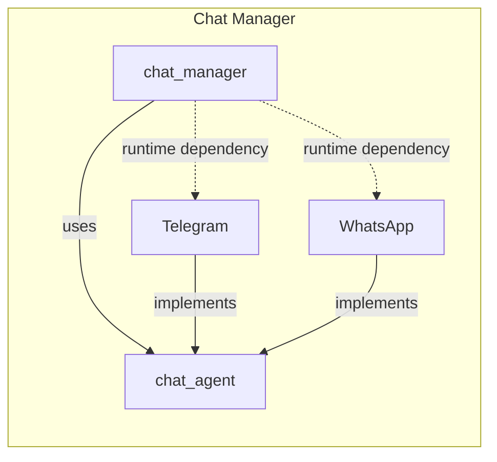
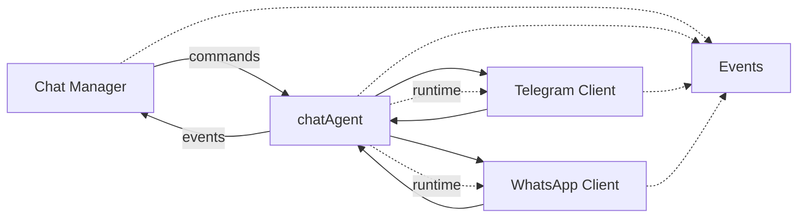

## Arquitectura propuesta en el primer refactor



The EFS:

```
tdlib/
  gocentius/
    instance-1/
    instance-2/
  eadtrust/
    instance-1/
    instance-2/
```

No es posible porque no puede haber N clietes de Telegram activos en diferentes nodos, ya que dispararían los eventos que se reciben de Telegram varias veces.

## Arquitectura nueva




The EFS:

```
tdlib/
  gocentius/
  eadtrust/
```

Puntos a tener en cuenta:

* Puede haber **N agentes de chat** (Telegram, WhatsApp)
* Un agente puede dar servicio N tenants

